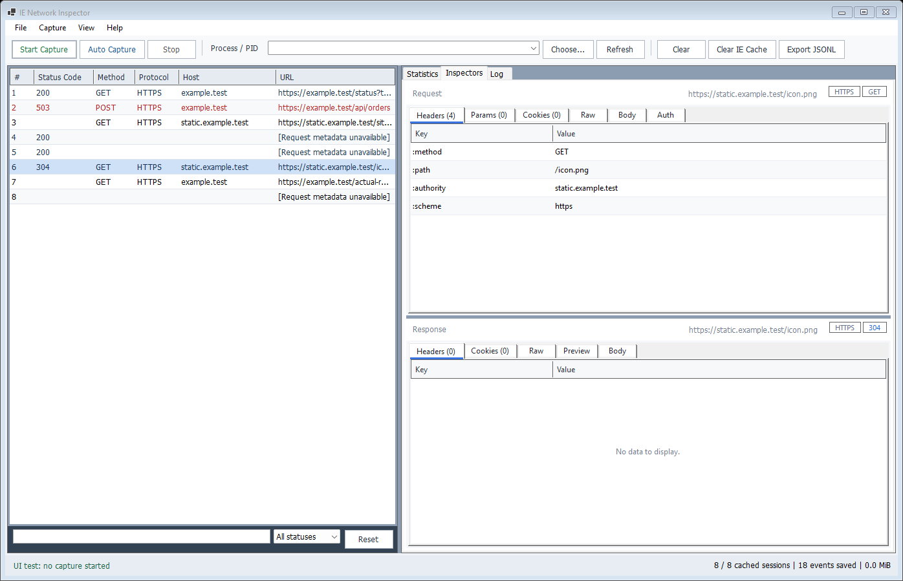

# IE Network Inspector

IE Network Inspector is a Windows desktop tool for capturing and inspecting HTTP
traffic from Microsoft Edge Internet Explorer mode processes. It uses the public
`Windows.Web.Http.Diagnostics.HttpDiagnosticProvider` API and does not install a
proxy, service, certificate, or browser extension.

> **Experimental:** This is an independent diagnostic tool, not an official
> Microsoft product or a supported replacement for IE F12 Developer Tools.

> **Privacy:** Captured URLs, headers, cookies, authorization values, query
> strings, and available request/response bodies are stored without redaction.
> Use the tool only with traffic you are authorized to inspect.



## Download

Download the [latest release](https://github.com/ylq-cg/IENetWorkInspector/releases/latest):

- Use the **win-x64** package for an x64 IE-mode process.
- Use the **win-x86** package for an x86 IE-mode process.
- Extract the archive to a writable directory and run `IENetworkInspector.exe`.

The current source also supports a unified x64 desktop package with an embedded
x86 capture worker. Build it with `Build-Unified.cmd` as described below. Existing
architecture-specific release downloads are not retroactively updated.

The release packages are self-contained and do not require a separate .NET
installation. Windows displays a UAC prompt because process diagnostics require
an administrator token. Microsoft Edge WebView2 Runtime is required for the
isolated HTML response preview and is normally installed with Microsoft Edge.

## Features

- Finds IE-mode candidate processes and displays their x86/x64 architecture.
- Shows available page titles and URLs in the process selector and **Choose...** dialog.
- Automatically selects an x86 or x64 worker in the unified desktop package.
- Supports manual process selection and explicit Start/Stop controls.
- Lists sessions by status code, method, protocol, host, URL, and timing.
- Filters sessions by URL, host, method, status, or content type.
- Shows structured request Headers, Params, Cookies, Raw, Body, and Auth views.
- Shows structured response Headers, Cookies, Raw, Preview, and Body views.
- Formats captured Text, JSON, HEX, XML, JavaScript, and form data.
- Previews supported images and renders captured HTML with scripts and external
  requests disabled.
- Captures available request/response bodies until stopped.
- Saves every event to a local JSONL journal and exports the complete journal.
- Reports permission, architecture, and native provider startup failures.

## Capture Traffic

1. Start `IENetworkInspector.exe` and approve the UAC prompt.
2. Open an existing Edge IE-mode page, click **Refresh**, and choose its request
  process. The unified UI selects the matching worker automatically; older
  architecture-specific packages still require a matching target.
3. Click **Start Capture** and wait for **Capturing**.
4. Reproduce or refresh the target page.
5. Select a session to inspect its request, response, preview, and timing.
6. Click **Stop**, then **Export JSONL** if the full journal is needed.

Select an existing target process and start capture before reproducing the
request. The UI does not watch for new processes or attach automatically;
requests made before attachment may be missed. Refresh and reselect the target
if navigation creates a different process.

On **Refresh** or **Choose...**, titled candidates appear as
`PID (process 32bit/64bit) | Page title - URL` (the UI uses full-width parentheses).
For example, an x86 IE process displays its PID, `iexplore 32bit`, and the page
title followed by its URL. Untitled candidates keep the PID, process name and
architecture. Unknown architectures are explicitly labeled rather than guessed.
Manual PID entry remains available. The tool associates an `Internet Explorer_Server`
window's PID with the nearest titled `TabWindowClass` or `IEFrame` ancestor;
the ancestor may belong to a different process. **Choose...** retains separate
process architecture and detection columns. Multiple titles sharing one PID
are combined into one candidate; capture remains process-wide, not tab-specific.

Only the recognized `HTTP(S) URL - title` caption format is rearranged. Other
caption formats keep their order. A trailing ` - Internet Explorer` suffix is
removed when a nonempty title remains; matching words inside the title are kept.
Inaccessible/missing titles fall back to the
process name and architecture. Titles are display hints, not authoritative
request URLs, and may contain sensitive information. Window class names and
relationships are heuristics, not an official IE-mode tab discovery contract.

A session containing only a `completed` event means capture attached after that
request started. Missing request, response, and body events cannot be recovered.

## Inspector Views

Request views:

- **Headers:** pseudo-headers and captured HTTP/content headers.
- **Params:** decoded URL query parameters.
- **Cookies:** parsed request cookies.
- **Raw:** reconstructed metadata and captured body; not original wire bytes.
- **Body:** Text, JSON, HEX, MessagePack, Protobuf, Form-Data, XML, and JavaScript.
- **Auth:** captured authorization headers.

Response views:

- **Headers:** captured response and content headers.
- **Cookies:** parsed `Set-Cookie` values and attributes.
- **Raw:** reconstructed metadata and captured body.
- **Preview:** supported images or isolated HTML.
- **Body:** Text, JSON, HEX, MessagePack, Protobuf, XML, and JavaScript.

MessagePack and Protobuf require format/schema knowledge not supplied by the
Windows diagnostics API; these tabs explain the limitation when decoding is not
available.

## Cache and 304 Responses

`304 Not Modified` responses intentionally have no response body. The browser
uses its cached copy, which this process-scoped diagnostic stream cannot expose.
The tool cannot convert a `304` into a `200` or modify request headers because
`HttpDiagnosticProvider` is a passive diagnostics API.

The tool does not clear the browser cache. **Clear** only clears the current
inspector view; previously persisted capture journals remain on disk.

To try obtaining a fresh response body:

1. Close all Edge and Internet Explorer windows and background processes.
2. If permitted, clear temporary Internet files using your browser or Windows settings.
3. Open the target IE-mode page, refresh the process list and select its process.
4. Click **Start Capture** and wait for **Capturing**.
5. Navigate or hard-refresh with `Ctrl+F5`.

For browser-controlled cache disabling, open the IE-mode page and run:

```text
C:\Windows\System32\F12\IEChooser.exe
```

Select the page, open the Network tool, and enable **Always refresh from server**
or its equivalent. IEChooser uses an internal browser debugging channel; this
project does not call private F12 interfaces.

## Saved Data

Capture journals are stored under:

```text
%LOCALAPPDATA%\IENetworkInspector\Captures
```

Versions before `v0.4.0` used `%LOCALAPPDATA%\IeNetworkDemo\Captures`. Existing
journals are not moved automatically.

Journals are UTF-8 JSON Lines files. They are not encrypted or automatically
rotated. Files remain after clearing the UI or closing the application. Protect
and delete them according to your organization's retention requirements.

The live UI caches up to 1000 recent activities, approximately 32 MiB of event
and preview data, and up to 4 MiB of preview bytes per body. Export reads the
full journal, including records evicted from the live UI.

## Troubleshooting

### Access denied (`0x80070005`)

Confirm the application was started through `IENetworkInspector.exe` and the UAC
prompt was approved. The Log should show:

```text
Enabled administrator role: True
```

Elevation does not guarantee access to every target process or provider.

### Target/provider architecture mismatch

The capture worker and target process must use the same architecture. The unified
UI checks the target PID immediately before launching capture. It uses itself for
an x64 target and `workers\x86\IENetworkInspector.exe` for an x86 target.
This worker selection happens when Start is clicked, not by watching for new
processes. Unknown/unsupported architectures
or missing/mismatched worker binaries produce an error rather than a fallback
to unsafe cross-architecture capture. The worker rechecks target architecture.

Keep the entire unified folder together; do not move only the main EXE. Both
workers are self-contained and inherit the UI's permissions and redirected
stop/data channels. They are not launched through an elevation prompt by the UI.
Direct CLI capture is still architecture-specific: select the matching executable
when using a PID on the command line. Routing does not resolve unrelated Windows
provider errors or guarantee complete data capture.

### Native crash (`0xC0000005`)

A fatal access violation in `HttpDiagnosticProvider.Start` occurs inside the
Windows diagnostics provider before capture starts and cannot be caught as a
normal .NET exception. First verify matching architectures. Then run the
self-probe from an elevated terminal:

```powershell
dotnet .\IENetworkInspector.dll --probe-http-self
```

If the self-probe also crashes, record the exact Windows build and report the
provider issue. If it succeeds, retry another matching-architecture IE candidate.

### No or incomplete sessions

- Confirm the selected PID actually issues the page's requests.
- Refresh the candidate list after navigation creates a new process.
- Start capture before navigating to the target page.
- Cached resources may produce no new request or a bodyless `304` response.
- A PID is not a tab filter; multiple tabs may share one process.

## Known Limitations

- Candidate detection is heuristic and does not identify a specific browser tab.
- The public API may omit events or bodies and does not provide historical backfill.
- Captured data is HTTP metadata/body content exposed by the Windows diagnostics
  API, not an exact wire dump.
- The tool does not modify proxy, TLS, certificate, browser policy, or cache
  request headers.
- Forced termination can leave an incomplete final journal record.

## Build from Source

Requirements: Windows and the [.NET 9 SDK](https://dotnet.microsoft.com/download/dotnet/9.0).

```powershell
dotnet build IeNetworkDemo.csproj -c Release -o bin\IENetworkInspector
dotnet .\bin\IENetworkInspector\IENetworkInspector.dll --self-test
dotnet .\bin\IENetworkInspector\IENetworkInspector.dll --ui-self-test
```

For a single desktop entry point on x64 Windows, run:

```cmd
Build-Unified.cmd
```

The self-contained output is:

```text
bin\IENetworkInspector-Unified\IENetworkInspector.exe
bin\IENetworkInspector-Unified\workers\x86\IENetworkInspector.exe
```

Run only the top-level EXE; the UI chooses the worker. `Open-UI.cmd` builds this
unified package and starts the top-level UI. Initial publishing requires downloads
of both runtime packs. Close running instances before rebuilding. The unified
package targets x64 Windows; ARM64 and 32-bit Windows are not included in this
unified packaging change. Separate builds remain available using explicit RIDs.

The application uses public Windows/.NET APIs plus Microsoft WebView2. Window
title discovery in `IeWindowTitles.cs` uses only the documented `user32.dll`
APIs [EnumWindows](https://learn.microsoft.com/en-us/windows/win32/api/winuser/nf-winuser-enumwindows),
[EnumChildWindows](https://learn.microsoft.com/en-us/windows/win32/api/winuser/nf-winuser-enumchildwindows),
[GetClassNameW](https://learn.microsoft.com/en-us/windows/win32/api/winuser/nf-winuser-getclassnamew),
[GetWindowTextW](https://learn.microsoft.com/en-us/windows/win32/api/winuser/nf-winuser-getwindowtextw),
[GetWindowThreadProcessId](https://learn.microsoft.com/en-us/windows/win32/api/winuser/nf-winuser-getwindowthreadprocessid)
and [GetAncestor](https://learn.microsoft.com/en-us/windows/win32/api/winuser/nf-winuser-getancestor).
The self-test restricts handwritten native imports to this allowlist and checks
title formatting and cross-process window association. No private F12 interfaces
or hardcoded ETW provider identifiers are used. See the source and release notes
for implementation details and validated package hashes.
