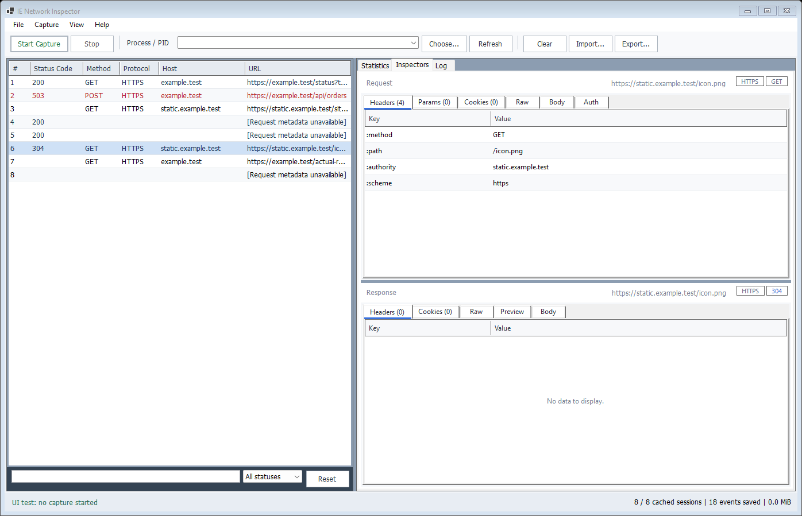
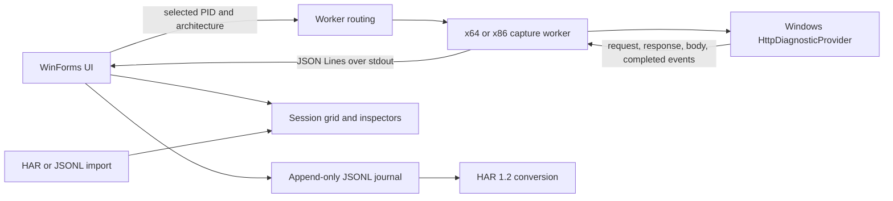

# IE Network Inspector

IE Network Inspector is a Windows desktop tool for capturing and inspecting HTTP
traffic from Microsoft Edge Internet Explorer mode processes. It uses the public
`Windows.Web.Http.Diagnostics.HttpDiagnosticProvider` API and does not install a
proxy, service, certificate, or browser extension.

> **Experimental:** This is an independent diagnostic tool, not an official
> Microsoft product or a supported replacement for IE F12 Developer Tools.

> **Privacy:** Captured URLs, headers, cookies, authorization values, query
> strings, and available request/response bodies are stored without redaction.
> Use the tool only with traffic you are authorized to inspect.



## Download

The current public binaries are the **v0.6.0 pre-release** on the
[v0.6.0 release page](https://github.com/ylq-cg/IENetWorkInspector/releases/tag/v0.6.0).
That release contains the unified ZIP, x64 MSI, and source archives. The
repository can contain changes newer than the published release.

The release assets are not code-signed. Follow your organization's
software approval policy before running either package. Build the current unified
package or MSI from source using the commands under **Build from Source**.

The published ZIP is self-contained and does not require a separate .NET
installation. Windows displays a UAC prompt because process diagnostics require
an administrator token. Microsoft Edge WebView2 Runtime is required for the
isolated HTML response preview and is normally installed with Microsoft Edge.

## Install

### MSI package

Close any running IE Network Inspector instance, open the MSI, and approve the
UAC prompt. It is a per-machine x64 package that installs to:

```text
%ProgramFiles%\IE Network Inspector
```

The setup wizard displays two independent shortcut checkboxes:

- **Create a Start menu shortcut** is selected by default.
- **Create a desktop shortcut** is not selected by default.
- Clear both checkboxes to install without shortcuts.

The package includes the x64 application and its x86 capture worker. It does not
install Microsoft Edge WebView2 Runtime. Setup and uninstall require elevation,
and the installed application also requests elevation each time it starts.

For unattended installation, run from an elevated terminal:

```cmd
msiexec /i path\to\package.msi /qn /norestart
```

Silent installation uses the same shortcut defaults. Override either option
with public MSI properties:

```cmd
msiexec /i path\to\package.msi /qn /norestart CREATE_START_MENU_SHORTCUT=0 CREATE_DESKTOP_SHORTCUT=1
```

Use `/l*v install.log` to create a verbose Windows Installer log.

### Unified ZIP

Extract the entire ZIP to one directory and run only the top-level
`IENetworkInspector.exe`. Keep all published files and the `workers` directory
together; copying only the EXE does not produce a runnable application. The ZIP
version is portable and does not create shortcuts or an Installed Apps entry.
It targets x64 Windows and includes an x86 worker for x86 targets; it is not a
native ARM64 or 32-bit Windows package.

## Upgrade

Close the application before upgrading. Running an MSI with a higher product
version upgrades the existing per-machine installation and removes the older
installed version. Downgrades are blocked. Capture journals and WebView2 user
data under `%LOCALAPPDATA%\IENetworkInspector` are preserved.

The MSI version comes from `IeNetworkDemo.csproj`. When testing a locally rebuilt
MSI that still has the same version as the installed package, uninstall the old
package first; same-version rebuilds are not treated as upgrades. For the ZIP
distribution, replace the entire extracted directory while the application is
closed rather than mixing files from different builds.

## Uninstall

Open **Settings > Apps > Installed apps**, find **IE Network Inspector**, choose
**Uninstall**, and approve the UAC prompt. The MSI removes installed application
files and the shortcuts it created. You can also uninstall with the original MSI:

```cmd
msiexec /x path\to\package.msi
```

For unattended uninstall, add `/qn /norestart`. Uninstall intentionally preserves
capture journals and WebView2 user data. Imported files remain at their original
locations and are never managed by the installer. To remove the remaining
application data after reviewing it, delete:

```text
%LOCALAPPDATA%\IENetworkInspector
```

The portable ZIP has no registered uninstaller; close the application and delete
its extracted directory. Capture journals in `%LOCALAPPDATA%` remain until deleted
separately.

## Features

- Finds IE-mode candidate processes and reports their detected architecture;
  the unified package captures x86 and x64 targets.
- Shows available page titles and URLs in the process selector and **Choose...** dialog.
- Automatically selects an x86 or x64 worker in the unified desktop package.
- Supports manual process selection and explicit Start/Stop controls.
- Lists sessions by status code, method, protocol, host, URL, and timing.
- Filters sessions by URL, host, method, status, or content type.
- Shows structured request Headers, Params, Cookies, Raw, Body, and Auth views.
- Shows structured response Headers, Cookies, Raw, Preview, and Body views.
- Formats captured Text, JSON, HEX, XML, and JavaScript, and displays decoded
  URL query values in the Form-Data view.
- Previews supported images and renders captured HTML with scripts and external
  requests disabled.
- Captures available request/response bodies until stopped.
- Persists live capture events to a local JSONL journal and supports JSONL
  preservation or best-effort HAR 1.2 conversion.
- Imports or accepts dropped JSONL and HAR captures for formatted offline inspection.
- Reports permission, architecture, and native provider startup failures.

## How It Works

IE Network Inspector observes the selected process through the public Windows
`HttpDiagnosticProvider` API. It does not decrypt traffic, insert a proxy, install
a certificate, or change browser settings. The API reports HTTP activity that
Windows makes available for the target process, so missing historical, cached,
or body data cannot be reconstructed.


```mermaid
flowchart LR
  UI[WinForms UI] -->|selected PID and architecture| Router[Worker routing]
  Router --> Worker[x64 or x86 capture worker]
  Worker --> API[Windows HttpDiagnosticProvider]
  API -->|request, response, body, completed events| Worker
  Worker -->|JSON Lines over stdout| UI
  UI --> Journal[Append-only JSONL journal]
  UI --> Inspectors[Session grid and inspectors]
  Journal --> HarExport[HAR 1.2 conversion]
  Import[HAR or JSONL import] --> Inspectors
```

The top-level x64 UI checks the target PID architecture before capture. It uses
its own executable for an x64 target and launches the bundled
`workers\x86\IENetworkInspector.exe` for an x86 target. Unsupported or mismatched
architectures are rejected instead of attempting unsafe cross-architecture
capture.

The worker serializes `request`, `response`, `body`, `body-chunk`, and `completed`
events as one JSON value per line. The UI appends each live event to disk, groups
events by `activityId`, and updates the session list and inspectors. Body reads
run asynchronously; large bodies are streamed as ordered Base64 chunks. The
journal retains persisted events while the UI uses bounded caches for responsive
preview and filtering.

JSONL import validates one event per non-empty line and feeds those events through
the same session reducer without creating a new journal. HAR import normalizes
each `log.entries` item into the internal event model. Export either preserves the
source format or converts between JSONL and HAR using only available data.

Key files:

| File | Responsibility |
| --- | --- |
| `Program.cs` | Entry point, CLI, process discovery, diagnostics worker, and event serialization |
| `CaptureForm.cs` | WinForms UI, worker lifecycle, event correlation, inspectors, import, and export actions |
| `CaptureJournal.cs` | Append-only JSONL persistence and atomic JSONL export |
| `WorkerRouting.cs` | x86/x64 worker selection and executable architecture validation |
| `HarExporter.cs` | Best-effort JSONL-to-HAR 1.2 conversion |
| `HarImporter.cs` | HAR validation and normalization into internal events |

## Capture Traffic

1. Start `IENetworkInspector.exe` and approve the UAC prompt.
2. Open an existing Edge IE-mode page, click **Refresh**, and choose its request
  process. The unified UI selects the matching worker automatically.
3. Click **Start Capture** and wait for **Capturing**.
4. Reproduce or refresh the target page.
5. Select a session to inspect its request, response, preview, and timing.
6. Click **Stop**, then **Export...** and choose HAR or JSONL.

Select an existing target process and start capture before reproducing the
request. The UI does not watch for new processes or attach automatically;
requests made before attachment may be missed. Refresh and reselect the target
if navigation creates a different process.

**Refresh** and **Choose...** show PID, detected architecture, and any available
page title/URL hints. Manual PID entry remains available. Candidate and title
detection is heuristic, titles can contain sensitive information, and capture is
process-wide rather than limited to one browser tab.

A session containing only a `completed` event means capture attached after that
request started. Missing request, response, and body events cannot be recovered.

## Inspector Views

Request views:

- **Headers:** pseudo-headers and captured HTTP/content headers.
- **Params:** decoded URL query parameters.
- **Cookies:** parsed request cookies.
- **Raw:** reconstructed metadata and captured body; not original wire bytes.
- **Body:** Text, JSON, HEX, MessagePack, Protobuf, XML, and JavaScript. The
  Form-Data tab currently displays URL query values, not a decoded request body.
- **Auth:** captured authorization headers.

Response views:

- **Headers:** captured response and content headers.
- **Cookies:** parsed `Set-Cookie` values and attributes.
- **Raw:** reconstructed metadata and captured body.
- **Preview:** supported images or isolated HTML.
- **Body:** Text, JSON, HEX, MessagePack, Protobuf, XML, and JavaScript.

MessagePack and Protobuf require format/schema knowledge not supplied by the
Windows diagnostics API; these tabs explain the limitation when decoding is not
available.

## Cache and 304 Responses

`304 Not Modified` responses intentionally have no response body. The browser
uses its cached copy, which this process-scoped diagnostic stream cannot expose.
The tool cannot convert a `304` into a `200` or modify request headers because
`HttpDiagnosticProvider` is a passive diagnostics API.

The tool does not clear the browser cache. **Clear** only clears the current
inspector view; previously persisted capture journals remain on disk.

To try obtaining a fresh response body:

1. Close all Edge and Internet Explorer windows and background processes.
2. If permitted, clear temporary Internet files using your browser or Windows settings.
3. Open the target IE-mode page, refresh the process list and select its process.
4. Click **Start Capture** and wait for **Capturing**.
5. Navigate or hard-refresh with `Ctrl+F5`.

For browser-controlled cache disabling, open the IE-mode page and run:

```text
C:\Windows\System32\F12\IEChooser.exe
```

Select the page, open the Network tool, and enable **Always refresh from server**
or its equivalent. IEChooser uses an internal browser debugging channel; this
project does not call private F12 interfaces.

## Saved Data

Capture journals are stored under:

```text
%LOCALAPPDATA%\IENetworkInspector\Captures
```

Journals are UTF-8 JSON Lines files. They are not encrypted or automatically
rotated. Files remain after clearing the UI or closing the application. Protect
and delete them according to your organization's retention requirements.

Use **Import...** or drop one `.jsonl` or `.har` file onto the application or
session list to inspect a saved capture. Importing a file replaces the sessions
currently shown but does not modify the source file. The same request/response
inspectors, formatting, filters, and previews are available for imported data.
JSONL requires one complete JSON event per non-empty line. HAR import accepts a
HAR `log.entries` document and normalizes its available fields into the inspector.
Imported files are read in place and are not copied to the capture-journal folder.

After importing, **Export...** supports both formats. JSONL-to-JSONL and
HAR-to-HAR preserve the complete source file. JSONL-to-HAR converts captured
events to HAR 1.2; HAR-to-JSONL writes normalized request, response, body, and
completion events for the fields available in the HAR source.

The live UI caches up to 1000 recent activities, approximately 32 MiB of event
and preview data, and up to 4 MiB of preview bytes per body. Export and format
conversion read the source file rather than only the UI cache.

HAR export reconstructs eligible sessions with a URL and timestamp from the
complete JSONL source. Partial sessions can be omitted. The diagnostics stream
does not provide HTTP versions, response reason phrases, or exact wire sizes;
the capture format also collapses repeated header names. Bodies can be
unavailable, truncated, or incomplete. HAR uses unknown values and capture
warnings rather than inventing missing wire data.

## Troubleshooting

### Access denied (`0x80070005`)

Confirm the application was started through `IENetworkInspector.exe` and the UAC
prompt was approved. The Log should show:

```text
Enabled administrator role: True
```

Elevation does not guarantee access to every target process or provider.

### Target/provider architecture mismatch

The capture worker and target process must use the same architecture. The unified
UI checks the target PID immediately before launching capture. It uses itself for
an x64 target and `workers\x86\IENetworkInspector.exe` for an x86 target.
This worker selection happens when Start is clicked, not by watching for new
processes. Unknown/unsupported architectures
or missing/mismatched worker binaries produce an error rather than a fallback
to unsafe cross-architecture capture. The worker rechecks target architecture.

Keep the entire unified folder together; do not move only the main EXE. Both
workers are self-contained. Direct CLI capture remains architecture-specific:
use the matching x86 or x64 executable for the target process.

### Native crash (`0xC0000005`)

A fatal access violation in `HttpDiagnosticProvider.Start` occurs inside the
Windows diagnostics provider before capture starts and cannot be caught as a
normal .NET exception. First verify matching architectures. Then run the
self-probe from an elevated terminal:

```powershell
.\IENetworkInspector.exe --probe-http-self
```

If the self-probe also crashes, record the exact Windows build and report the
provider issue. If it succeeds, retry another matching-architecture IE candidate.

### HTML preview unavailable

The Preview tab requires Microsoft Edge WebView2 Runtime. If initialization fails,
install or repair the Evergreen WebView2 Runtime, restart the application, and
check the Log tab. Capture and non-HTML inspectors remain available without it.

### No or incomplete sessions

- Confirm the selected PID actually issues the page's requests.
- Refresh the candidate list after navigation creates a new process.
- Start capture before navigating to the target page.
- Cached resources may produce no new request or a bodyless `304` response.
- A PID is not a tab filter; multiple tabs may share one process.

## Known Limitations

- Candidate detection is heuristic and does not identify a specific browser tab.
- The public API may omit events or bodies and does not provide historical backfill.
- Captured data is HTTP metadata/body content exposed by the Windows diagnostics
  API, not an exact wire dump.
- HAR conversion is best effort and can omit partial sessions or unknown fields.
- The tool does not modify proxy, TLS, certificate, browser policy, or cache
  request headers.
- Forced termination can leave an incomplete final journal record.

## Command Line

Run CLI capture from an elevated terminal using the executable whose architecture
matches the target process. Use `--help` for the current command summary.

```powershell
.\IENetworkInspector.exe --list
.\IENetworkInspector.exe --auto --seconds 30 --body-bytes 65536
.\IENetworkInspector.exe 1234 --seconds 30 --body-bytes 0
.\IENetworkInspector.exe --diagnose
.\IENetworkInspector.exe --probe-http-self
```

Capture events are written as JSON Lines to stdout and status messages to stderr.
`--seconds` accepts 1–300 seconds; `--body-bytes` accepts 0–65536 bytes per body
and defaults to 0, so CLI body capture is opt-in. A CLI run stops after 2000
events. `--auto` lists candidates and prompts for a PID when more than one is
available. `--self-test` runs non-UI checks. `--ui-self-test` also initializes
WebView2 and writes viewport screenshots, so it requires an interactive Windows
desktop and a usable WebView2 Runtime.

## Build and Run from Source

Requirements:

- Windows x64.
- [.NET 9 SDK](https://dotnet.microsoft.com/download/dotnet/9.0).
- Microsoft Edge WebView2 Runtime for HTML preview and the UI self-test.
- Internet access on the first restore/publish to download NuGet packages and
  the x64/x86 .NET runtime packs.

Clone the repository, or extract the source archive, then open PowerShell in the
repository root containing `IeNetworkDemo.csproj`:

```powershell
git clone https://github.com/ylq-cg/IENetWorkInspector.git
Set-Location .\IENetWorkInspector
dotnet restore .\IeNetworkDemo.csproj
dotnet build .\IeNetworkDemo.csproj -c Release -o .\bin\IENetworkInspector
```

Start the framework-dependent development build with its generated EXE so the
application manifest can request elevation:

```powershell
.\bin\IENetworkInspector\IENetworkInspector.exe
```

This development output requires the .NET 9 runtime/SDK on the machine and only
contains the current architecture. To run the automated checks without launching
the normal UI:

```powershell
dotnet .\bin\IENetworkInspector\IENetworkInspector.dll --self-test
dotnet .\bin\IENetworkInspector\IENetworkInspector.dll --ui-self-test
```

`--ui-self-test` opens a test form, initializes WebView2, and writes viewport
screenshots to the build output directory. It does not start traffic capture.

For the self-contained x64 UI plus bundled x86 worker used by the release ZIP,
run:

```cmd
Build-Unified.cmd
```

The self-contained output is:

```text
bin\IENetworkInspector-Unified\IENetworkInspector.exe
bin\IENetworkInspector-Unified\workers\x86\IENetworkInspector.exe
```

Run only the top-level EXE:

```powershell
.\bin\IENetworkInspector-Unified\IENetworkInspector.exe
```

The UI chooses the worker. `Open-UI.cmd` combines the unified build and launch
steps. Close running instances before rebuilding. The unified package targets
x64 Windows and includes its x86 worker; it does not provide a native ARM64 or
32-bit Windows desktop package.

To build the per-machine x64 MSI, run:

```cmd
Build-Msi.cmd
```

The MSI is written to
`bin\Installer\IENetworkInspector-<version>-win-x64.msi`. It includes the unified
x64 application and x86 worker. See **Install**, **Upgrade**, and **Uninstall**
for deployment behavior. `Build-Msi.cmd` first rebuilds the unified publish
directory, then restores/builds the WiX project under `installer`.
